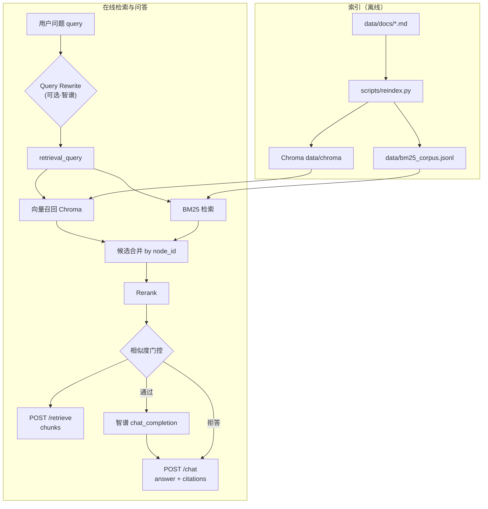
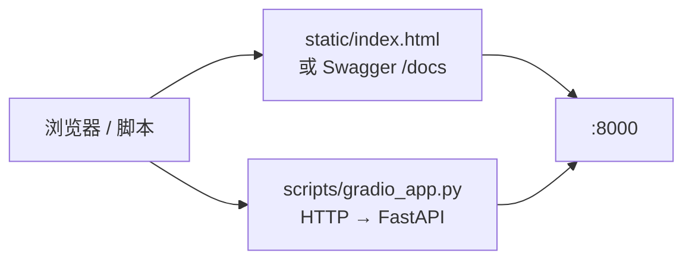
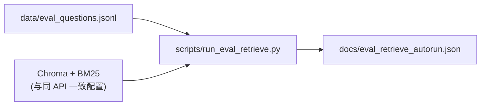
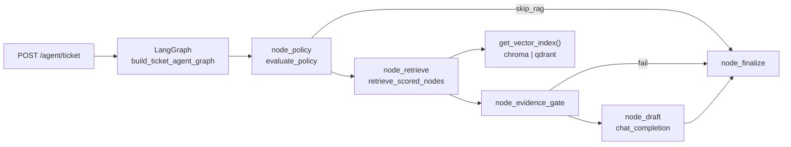

# 企业知识库 RAG 架构（enterprise-rag-kb）

本文描述当前仓库的运行时数据流与主要模块，便于联调、面试讲解与后续加 Docker。

---

## 总览（请求路径）

说明：`/chat` 在门控失败时直接返回拒答文案，**不调用** LLM；拼进 LLM 的「用户问题」仍为原始 `query`，仅检索侧使用 `retrieval_query`。

---

## 客户端

---

## 离线 / 批处理

`run_eval_retrieve.py` 使用与线上一致的 `retrieve_scored_nodes`（含可选 Query Rewrite），并统计 `expect_top1_file_contains` 命中率（仅作弱监督参考）。

---

## 模块职责速查

| 模块 | 职责 |
|------|------|
| `app/config.py` | Pydantic Settings：路径、智谱、混合检索、Rerank、门控、**Query Rewrite 开关** |
| `app/query_rewrite.py` | 智谱将用户问题改写成短检索句（仅检索链路使用；对话仍使用原始 `query`） |
| `app/index_store.py` | LlamaIndex + Chroma 单例 |
| `app/embeddings.py` | 本地 Qwen3 Embedding |
| `app/chunking.py` | Markdown 分块策略 |
| `app/bm25_store.py` | jieba + BM25，语料来自 reindex |
| `app/retrieval_pipeline.py` | 向量 + BM25 合并 → Rerank；返回 `ScoredRetrieval(nodes, retrieval_query)` |
| `app/rerank.py` | `auto` / `qwen3_causal` / `cross_encoder`；Qwen CPU OOM 时可回退 |
| `app/retrieval_gates.py` | 重排分与阈值比较，决定是否拒答 |
| `app/routes_rag.py` | `/retrieve`、`/chat`；响应中带 `retrieval_query`（有改写时非空） |
| `scripts/reindex.py` | 读 `data/docs`，写 Chroma + `bm25_corpus.jsonl` |
| `scripts/gradio_app.py` | 调用本机 FastAPI；可强制开/关改写 |
| `app/vector_index.py` | **向量后端门面**：`VECTOR_BACKEND=chroma\|qdrant`，统一 `get_vector_index()` |
| `app/qdrant_index_store.py` | Qdrant 本地路径 / 远程 URL；与 Chroma 同 reindex 入口 |
| `app/agent_graph/` | LangGraph 工单：**policy → retrieve → gate → draft → finalize** |
| `app/routes_agent.py` | `POST /agent/ticket`；响应含 `audit_trace`、`final_action` |

---

## Agent 工单与向量门面（阶段 E / D）

- **默认向量后端仍为 Chroma**；切 Qdrant 需 `VECTOR_BACKEND=qdrant` + reindex（见 `docs/QDRANT-NEXT.md`）。
- **策略短路**：`should_skip_rag` 时 `final_action=policy_intercept`，图直接 finalize，不调用检索。
- **路径评测**：`data/eval_agent_ticket.jsonl` + `scripts/run_eval_agent_ticket.py`（mock，不加载索引）；收口 `docs/PHASE-E-CLOSURE.md`。
- **可观测性**：`event=agent_ticket` + 图内 `audit_trace`；策略层 `event=policy_eval` — 见 `docs/OBSERVABILITY-DESIGN.md`。

---

## 引用与「来源」

- **`/retrieve`**：返回 `chunks`（`file_name`、`heading`、`text` 等），供调试检索。  
- **`/chat`**：在门控通过后，将 Top-K chunk 拼入 Prompt，并要求模型使用 **[1]、[2]**；响应中的 **`citations`** 与 chunk 序号一一对应。  
- 这不等于严格的「引用校验 / 幻觉检测」（文档路线里的 V6）；若要升级，可在生成后加规则或模型校验步骤。

---

## 配置要点（摘）

- **Query Rewrite**：`.env` 中 **`QUERY_REWRITE_MODE=off|on|auto`**（默认 `auto`）；需智谱 Key 才能实际调用 LLM 改写。请求体也可传 `use_query_rewrite` 单次覆盖（`true`/`false`/`null` 遵循 Settings）。  
- **门控**：`RETRIEVAL_SIMILARITY_THRESHOLD` 等见 `.env.example`。  
- **CPU Rerank**：见 `QWEN_RERANK_CPU_MAX_LENGTH`（`app/qwen_rerank.py`）说明。

---

## Docker

当前按你的节奏可暂不容器化；需要时将 `FastAPI + Chroma 卷 + 模型挂载 + Gradio（可选）` 写入 Compose 即可与此图对齐。
